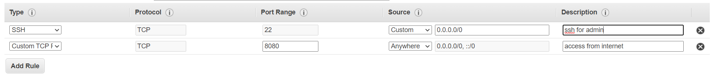
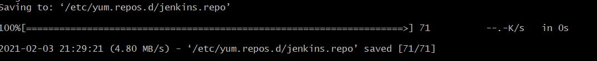
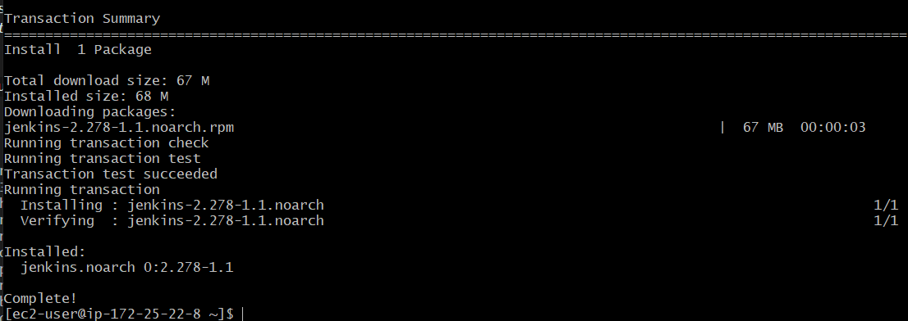
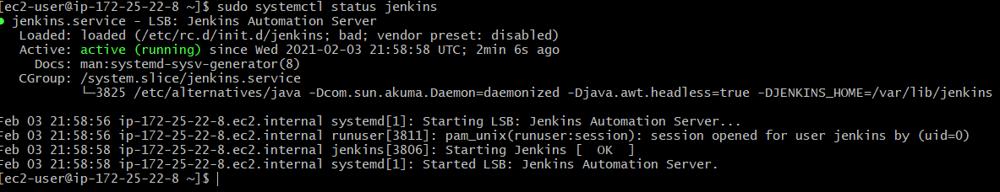
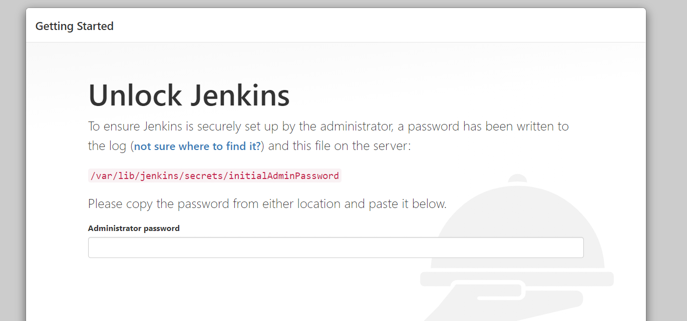
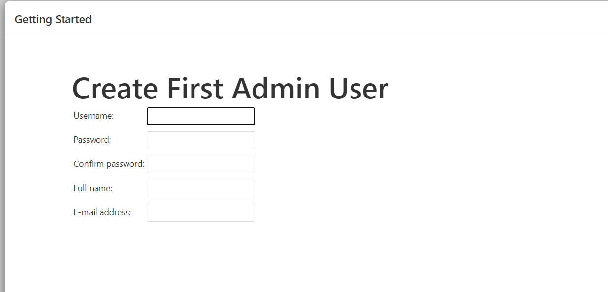

# jenkins-ec2

## These are the steps and resource used to get an jenkins sever running on an Amazon EC2 instances.

> The first step is to launch an ec2 server in a public subnet so that the server has access to the internet. 
While in the securtity group section of launch the ec2. make sure you open ports 8080(for jenkins) and 22 (ssh) for yourself.

>the next step is to connect to your instance via ssh, and run the following commands

* sudo yum update –y  (this updates the software on your instance)
* sudo yum install java-1.8.0-openjdk-devel -y (installing java - used by jenkins)

* sudo wget -O /etc/yum.repos.d/jenkins.repo https://pkg.jenkins.io/redhat/jenkins.repo   (this get the jenkins repo onto your server)

> the expect output should be following:

* sudo rpm --import https://pkg.jenkins.io/redhat/jenkins.io.key   (Importing a key file from Jenkins-CI to enable installation from the package)
> there should be no output if done coorrectly 

*sudo yum install jenkins -y  (installing jenkins)
> excepted output: 

* sudo systemctl start jenkins (starting jenkins service)
> no expected ouput

* sudo systemctl status jenkins (ensuring jenkins service is up and running)
> expected output:

* sudo systemctl enable jenkins (enabling the jenkins service across server restarts)

> the next step is to go to port 8080 of your server using your public IP. If all steps were done correctly you should see something like the following. 

>to get the initial administrative password use the following command 
* sudo cat /var/lib/jenkins/secrets/initialAdminPassword 

from there follow the steps prompt from the jenkins UI to complete creation of the server.

#Resources 
* https://d1.awsstatic.com/Projects/P5505030/aws-project_Jenkins-build-server.pdf

